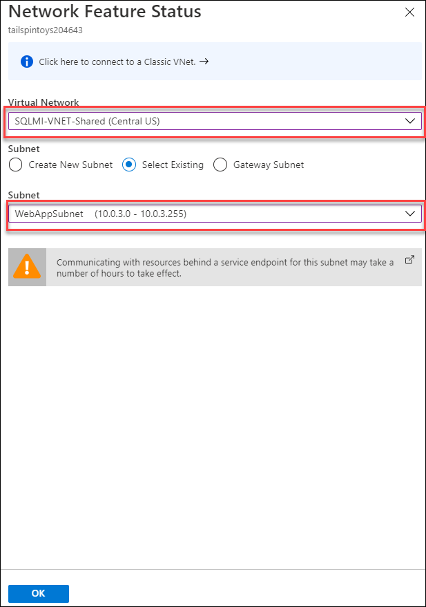
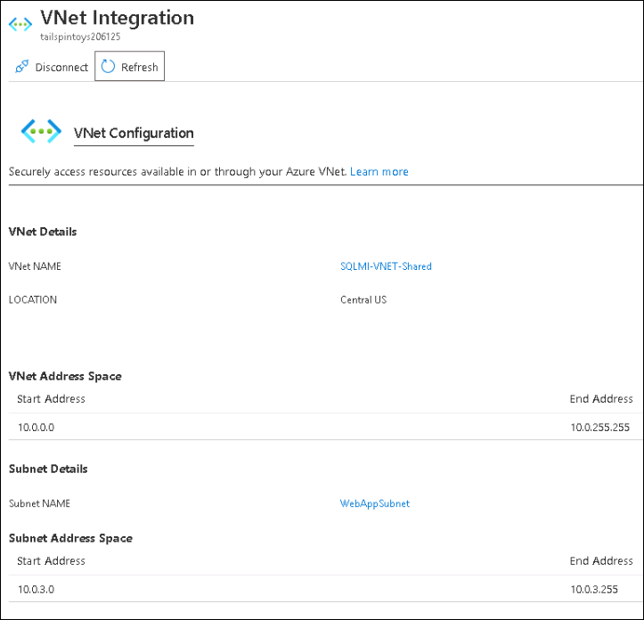

## Exercise 4: Integrate App Service with the virtual network

Duration: 15 minutes

In this exercise, you Integrate your App Service with the virtual network that was created during the Before the hands-on lab exercises. The ARM template created a Gateway subnet on the VNet, as well as a Virtual Network Gateway. Both of these resources are required to integrate App Service and connect to SQL MI.

### Task 1: Configure VNet integration with App Services

In this task, you add the networking configuration to your App Service to enable communication with resources in the VNet.

1. In the Azure portal, select **Resource groups** from the left-hand menu, select the **hands-on-lab-SUFFIX** resource group and then select the **tailspintoysSUFFIX** App Service from the list of resources.

   

2. On the App Service blade, select **Networking** from the left-hand menu and then select **Click here to configure** under **VNet Integration**.

    

3. Select **Add VNet** on the VNet Configuration blade.

    

4. On the Network Feature Status dialog, enter the following:

   - **Virtual Network**: Select the SQLMI-VNET-Shared.
   - **Subnet**: Select the WebAppSubnet.
  

    

5. Within a few minutes, the VNet is added, and your App Service is restarted to apply the changes. Select **Refresh** to see the details. You should see that the certificate status is Certificates in sync. **Note**: If the certificate status is not in sync, try hitting refresh, as it can take a moment for that status to be reflected.

    

    > **Note**: In you receive a message adding the Virtual Network to Web App failed, select **Disconnect** on the VNet Configuration blade, and repeat steps 3 - 5 above.

### Task 2: Open the web application

In this task, you verify your web application now loads, and you can see the home page of the web app.

1. Select **Overview** in the left-hand menu of your App Service, and select the **URL** of your App service to launch the website. This opens the URL in a browser window.

    

2. Verify that the web site and data are loaded correctly. The page should look similar to the following:

    

    > **Note**: If you get an error screen, try selecting Refresh in the browser window.

3. That's it. You successfully connected your application to the new SQL MI database.
