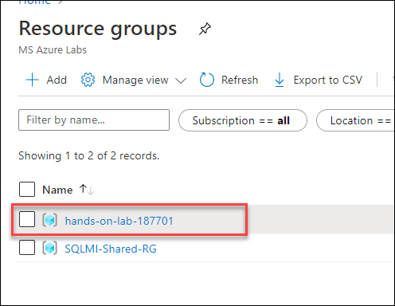

## Exercise 7: Use online secondary for read-only queries

Duration: 15 minutes

In this exercise, you examine how you can use the automatically created online secondary for reporting, without feeling the impacts of a heavy transactional load on the primary database. Each database in the SQL MI Business Critical tier is automatically provisioned with several AlwaysON replicas to support the availability SLA. 

### Task 1: View Leaderboard report in TailspinToys web application

In this task, you open a web report using the web application you deployed to your App Service.

1. In the Azure portal ```https://portal.azure.com```, select **Resource groups** from the Azure services list.

    

2. Select the hands-on-lab-SUFFIX resource group from the list.

    

3. In the hands-on-lab-SUFFIX resource group, select the **tailspintoys-SUFFIX** App Service from the list of resources.

   

4. On the App Service overview blade, select the **URL** to open the web application in a browser window.

   

5. In the TailspinToys web app, select **Leaderboard** from the menu.

   

   > Note the `READ_WRITE` string on the page. This is the output from reading the `Updateability` property associated with the `ApplicationIntent` option on the target database. This can be retrieved using the SQL query ```SELECT DATABASEPROPERTYEX(DB_NAME(), "Updateability")```.

### Task 2: Update read-only connection string

In this task, you enable Read Scale-Out for the `TailspinToysSUFFIX`database, using the `ApplicationIntent` option in the connection string. This option dictates whether the connection is routed to the write replica or a read-only replica. Specifically, if the `ApplicationIntent` value is `ReadWrite` (the default value), the connection is directed to the database's read-write replica. If the `ApplicationIntent` value is `ReadOnly`, the connection is routed to a read-only replica.

1. Return to the App Service blade in the Azure portal and select **Configuration** under Settings on the left-hand side.

   

2. On the Configuration blade, scroll down and locate the connection string named `TailspinToysReadOnlyContext` within the **Connection strings** section, and select the Pencil (edit) icon on the right.

   

3. In the Add/Edit connection string dialog, select the **Value** for the `TailspinToysReadOnlyContext` and paste the following parameter to the end of the connection string. 

   ```sql
   ApplicationIntent=ReadOnly;
   ```

4. The `TailspinToysReadOnlyContext` connection string should now look something like the following:

   ```sql
   Server=tcp:sqlmi-cus.a987e286d05a.database.windows.net,1433;Database=TailspinToysSUFFIX;User ID=contosoadmin;Password=IAE5fAijit0w^rDM;Trusted_Connection=False;Encrypt=True;TrustServerCertificate=True;ApplicationIntent=ReadOnly;
   ```

5. Select **OK**.

6. Select **Save** at the top of the Configuration blade, and select **Continue** when prompted about the application being restarted.

   

### Task 3: Reload Leaderboard report in the Tailspin Toys web app

In this task, you refresh the Leaderboard report in the Tailspin Toys web app, and observe the result.

1. Return to the TailspinToys gamer information website you opened previously, and refresh the **Leaderboard** page. The page should now look similar to the following:

    

    > Notice the `updateability` option is now displaying as `READ_ONLY`. With a simple addition to your database connection string, you can send read-only queries to the online secondary of your SQL MI Business-critical database, allowing you to load-balance read-only workloads using the capacity of one read-only replica. The SQL MI Business Critical cluster has built-in Read Scale-Out capability that provides free-of-charge built-in read-only node that can be used to run read-only queries that should not affect the performance of your primary workload.
